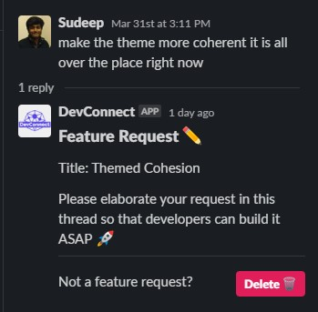
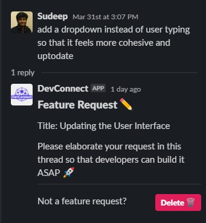
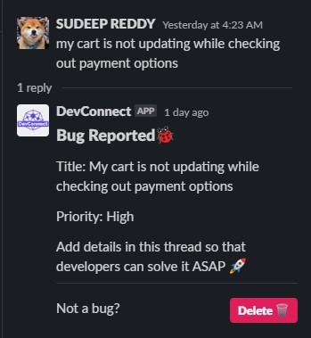
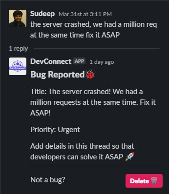
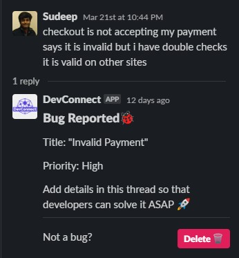
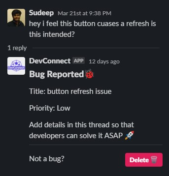
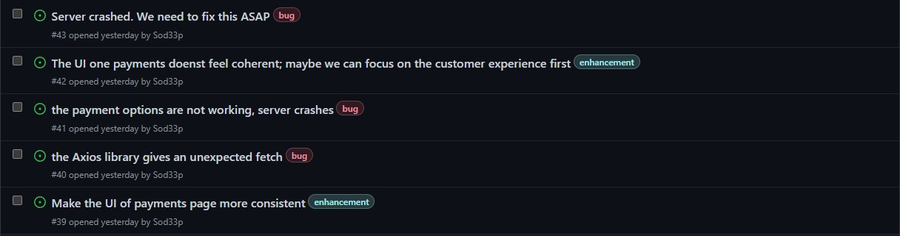
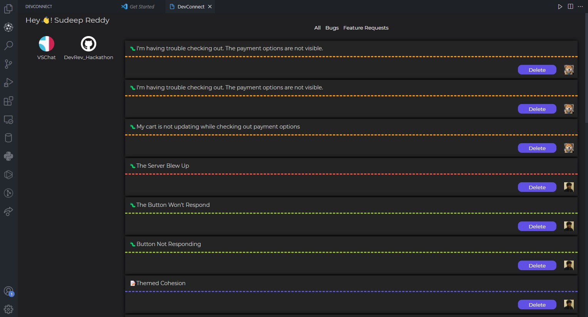

    

<!-- ### :tv: [Product Demo](https://youtu.be/UeXneXKmHkA) :tv: -->
<a href="https://youtu.be/UeXneXKmHkA"> <h3 align="center">:tv: Product Demo :tv:</h3> </a>

<b>Classify messages into bugs or feature requests and assign them a priority</b>

## The Problem :scream:
When developing a product, developers often need feedback from their customers and other devs.

The most effective way to to get this feedback is to have communities on slack, discord, github or reddit.

But the problem comes when the small team of developers is bombarded with issues, bugs, feedbacks, questions, chats, feature requests and much more during the development phase.

## The Solution :sunglasses:

Now time for developers is very important, and it is impossible to go through each message and classify them manually.

This is where DevConnect helps the developers.

DevConnect automatically classifies **messages** from **slack** and **issues** from **github** into **bugs** or **feature** **requests** and assigns them a **priority** so that developers can choose to work on the **important** tasks.

Q: And where does it show the classified tasks……..? 

A: **VSCode** -  where the developer spends most of his time developing his product.

## DevConnect Working Examples :white_check_mark:
### Slack Message Classification 
#### Feature Request Detection :pencil:
  
#### Bug Detection 	:bug:
    
### Github Issues Classification :octocat:

### DevConnect - VSCode Extention Showcase :globe_with_meridians:

## Project Setup :zap:
### Slack 
Create a slack app with the following:
**Assuming PUBLIC BASE URL would be where the slack bot is running**
1. Bot scopes = "chat:write", "channels:history","users:read","users:read.email","team:read"
2. Setup events and Oauth
    1. Oauth Redirect URL should be [PUBLIC BASE URL]/slack/oauth_redirect".
    2. Events URL would be [PUBLIC BASE URL]/slack/events
Install the app in your workspace.

## Github
1. In your developer settings initialise a Github App and add the details into the .env file.
2. Run probot from "backend/github-DevConnectBot" using npm start. 
3. Get the "smee" link and add that to the Github App Webhook URL with a Webhook secret.

## VSCode
1. In the vscode-extention directory run npm install and npm run watch to install packages and compile TS and Svelte files.
2. Press F5 to start testing the extention.
